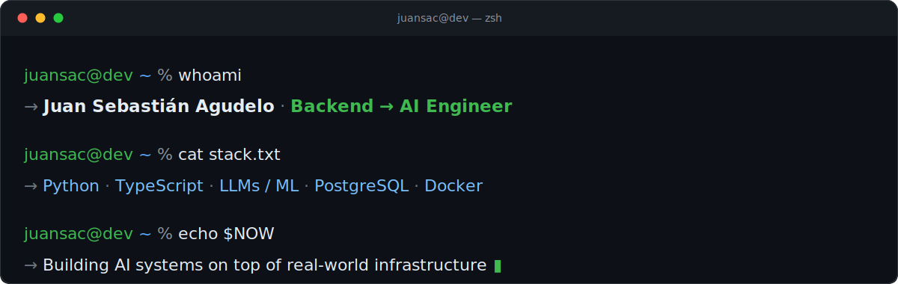

<!-- Banner: edit banner.svg to update your name, stack or tagline -->

  

### Hi There

Backend engineer with +6 years of experience, now focused on building with AI. I work across the stack — from data and infrastructure up to LLM-powered systems — and I care about shipping things that actually hold up in production.

### Stack

**Languages**: Python | Typescript | Go  
**Frameworks & Infra**: FastAPI | Fastify | Docker | K8s | PostgreSQL | DynamoDB | Terraform | Temporal  
**AI & ML**: RAG | Prompt & Context Eng. | LangGraph | Langfuse

### Currently

- 🔭 Building AI systems on top of real-world infrastructure
- 🌱 Going deep on LLMs, ML/MLOps and applied AI engineering
- ✍️ Writing a series that explains how things work under the hood
